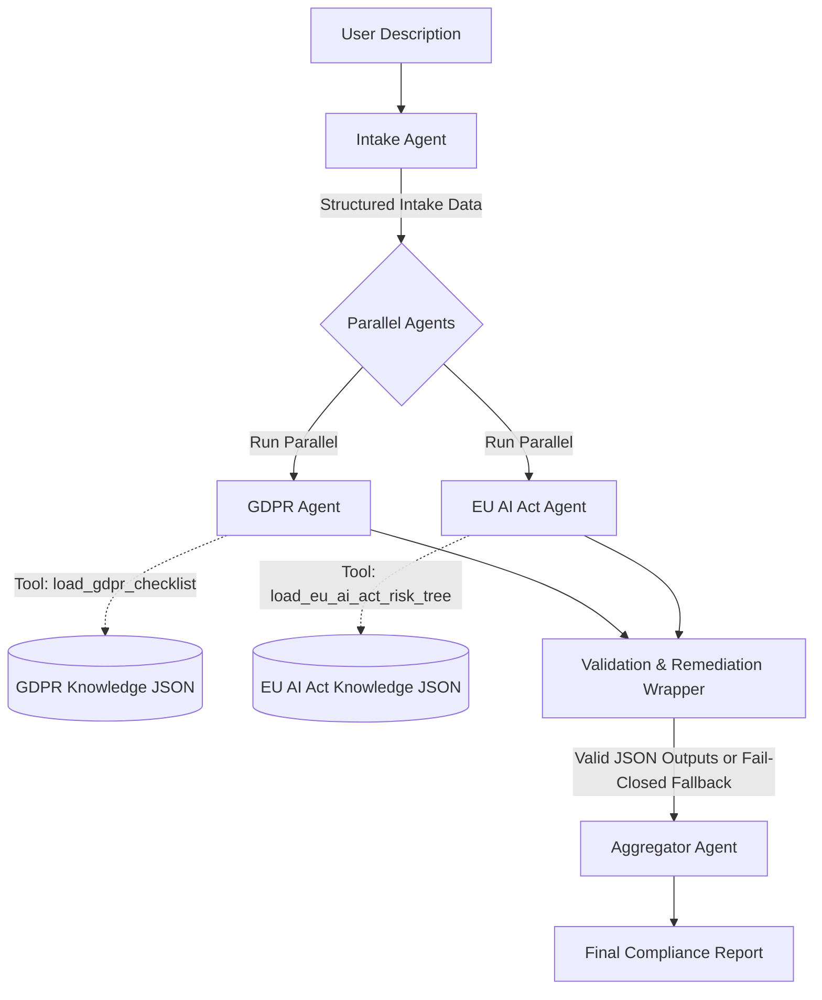

# Regulatory Compliance Copilot: Multi-Agent AI for GDPR & EU AI Act Readiness

This repository contains the source code for the **Regulatory Compliance Copilot**, a multi-agent AI system built to automate first-pass compliance checks for AI systems against the **GDPR** and the **EU AI Act**. 

Built with the [Google Agent Development Kit (ADK)](https://github.com/google/adk), this project demonstrates how to orchestrate specialized AI agents working in parallel to solve complex enterprise problems.

## 🌟 The Problem
Enterprises deploying AI systems must navigate overlapping and complex regulatory frameworks. Manual reviews are slow, require specialized legal expertise, and delay product launches. Attempting to automate this with a single LLM prompt fails due to hallucination and context-loss over hundreds of pages of legal text.

## 💡 The Solution
This project uses a **multi-agent architecture** acting as a "committee of experts". The problem is broken down into distinct, isolated agents armed with specific domain schemas. The Multi-Agent orchestration ensures that the GDPR auditor and the EU AI Act auditor work in parallel. 

Crucially, the system features a **Blue/Green Validation & Remediation Layer**. It deterministically validates agent JSON schemas. If an agent hallucinates, it forces a self-correction retry. If the agent continues to fail, a **Fail-Closed Escalation Gate** triggers, defaulting the compliance status to "High Risk - Requires Human Review" rather than outputting misleading approvals.

## 🏗️ Architecture



## 🛠️ Setup Instructions

### Prerequisites
- Python 3.10+
- OpenAI API Key (or another LLM provider supported by LiteLLM)

### Installation
1. Clone this repository.
2. Create and activate a virtual environment:
   ```bash
   python -m venv .venv
   source .venv/bin/activate  # On Windows: .venv\Scripts\activate
   ```
3. Install dependencies:
   ```bash
   pip install -r requirements.txt
   ```
4. Install the ADK evaluation module (required for running tests):
   ```bash
   pip install "google-adk[eval]"
   ```
5. Set up your environment variables by creating a `.env` file in the root directory:
   ```env
   OPENAI_API_KEY=your_openai_api_key_here
   ```

## 🚀 How to Run

### 1. Web UI (Gradio)
The easiest way to interact with the Copilot is via the included Gradio interface.
```bash
python app.py
```
This will launch a local web server (typically at `http://127.0.0.1:7860`). Open it in your browser, paste a description of an AI system (e.g., "An AI resume screener"), and watch the agents collaborate to produce a report.

### 2. ADK Trajectory Evaluations
The project includes strict trajectory tests verifying that the agents call the correct tools and reach the correct final classifications for 6 standard industry scenarios.
```bash
adk eval --config_file_path evals/eval_config.json . evals/compliance_eval.test.json
```

## 🛡️ Security & Reliability Features
- **Deterministic Schema Validation:** Agents are bound by strict JSON expectations.
- **Auto-Remediation:** Validation errors are automatically fed back to the LLM for correction.
- **Fail-Closed Gate:** System defaults to the highest risk tier if the LLM enters an unrecoverable hallucination loop. 

---
Disclaimer: This tool is an automated first-pass readiness check produced by an AI system. It is NOT legal advice, a compliance certification, or a substitute for professional legal review.*
